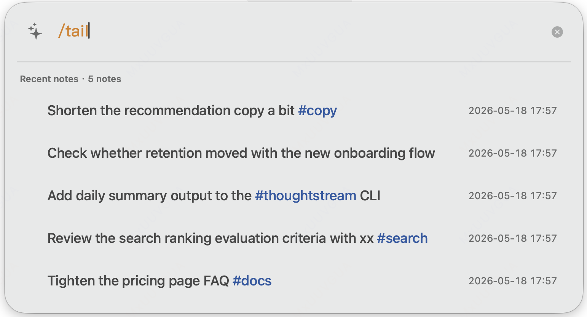
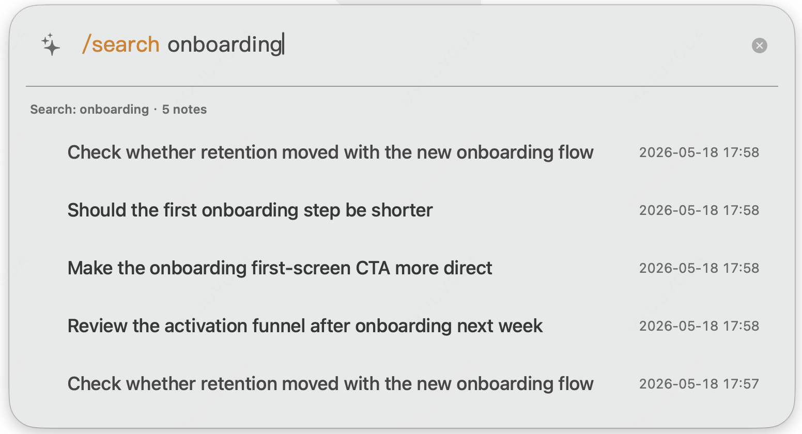

<p align="center">
  <a href="./README.zh-Hans.md">🇨🇳 简体中文</a>
  &nbsp;&bull;&nbsp;
  <strong>🇬🇧 English</strong>
</p>

# ThoughtStream

<p align="center">
  
</p>

ThoughtStream is a thought inbox, currently focused on macOS.

It is built for a simple workflow:

- stay in flow while working
- capture a thought, or a sudden incoming task, as soon as it appears
- record it with as little friction as possible, then get back to work
- come back later to review it with CLI and AI

Most note tools ask you to organize too early.

ThoughtStream is designed around a different idea:

1. capture without context switching
2. keep working
3. review later
4. summarize what mattered with modern AI tools

## Who It Is For

ThoughtStream is best for:

- Mac power users
- developers and CLI users
- writers, researchers, and note-heavy knowledge workers
- people who want something lighter than a full PKM app

It is not trying to be a full notes workspace.

## What It Includes

- `ThoughtStreamApp`
  - a Spotlight-style macOS overlay
  - global hotkey: `Shift+Command+Space`
  - low-friction capture, lightweight retrieval, and quick review
- `thought`
  - a CLI for querying, exporting, updating, and deleting thoughts
  - intended for scripting, automation, agent workflows, and AI-assisted review
- `thoughtstream-cli` skill
  - a repository skill for working with ThoughtStream notes through the CLI
  - useful as a reference workflow for agent-assisted review and retrieval

## Preview

Capture instantly:


Review later with `/tail`:



Search by theme:



## Quick Start

### One-line install (requires macOS 13+)

```bash
curl -fsSL https://raw.githubusercontent.com/MoozieLee/thought-stream/main/scripts/install.sh | sh
```

This downloads the latest release DMG from GitHub, installs the app to `/Applications`, and creates the `thought` CLI symlink.

If a build is unsigned or ad hoc signed, macOS may require a one-time manual approval on first launch. See [Distribution](docs/distribution.md) for first-run details and release packaging notes.

### Build from source

```bash
env HOME=$PWD/.home CLANG_MODULE_CACHE_PATH=$PWD/.build/ModuleCache swift build --product ThoughtStreamApp
env HOME=$PWD/.home CLANG_MODULE_CACHE_PATH=$PWD/.build/ModuleCache swift build --product thought
```

Install and launch the macOS app:

```bash
./scripts/install_app.sh
```

Or run the app directly:

```bash
./.build/debug/ThoughtStreamApp
```

## Basic Usage

Open the overlay with `Shift+Command+Space`.

- `Enter` saves a new thought
- `Shift+Enter` inserts a newline
- `Esc` cancels or exits the current mode
- `↓` opens recent notes
- `Tab` moves between input and result browsing

Built-in slash commands include:

- `/tail`
- `/search <query>`
- `/today`
- `/tag <tag>`
- `/archive`
- `/hide`
- `/keys`
- `/help`
- `/exit`

When the result list is open, you can browse, reuse, copy, pin, archive, delete, and edit existing thoughts.

## Why It Exists

ThoughtStream is not trying to be a full notes app.

The goal is to keep capture friction very low while you are working, then let retrieval, review, and summarization happen later against a stable store.

That means the project intentionally favors:

- append-first capture
- minimal interruption
- lightweight in-panel retrieval
- explicit CLI access for downstream review and AI workflows

And it intentionally avoids:

- heavy organization during capture
- turning the overlay into a workspace
- pushing AI into the capture moment

## Docs

- [Getting Started](docs/getting-started.md)
- [Overlay Guide](docs/overlay.md)
- [CLI Guide](docs/cli.md)
- [ThoughtStream CLI Skill](SKILL.md)
- [Tags](docs/tags.md)
- [Storage](docs/storage.md)
- [Distribution](docs/distribution.md)
- [Troubleshooting](docs/troubleshooting.md)
- [Roadmap](ROADMAP.md)

## Current Status

The current build already supports:

- native macOS overlay capture
- query-oriented CLI
- slash commands in the overlay
- result browsing, reuse, copy, pin, archive, delete, and editing
- release packaging scripts for `.app`, `.zip`, and `.dmg`

## License

[MIT](LICENSE)
