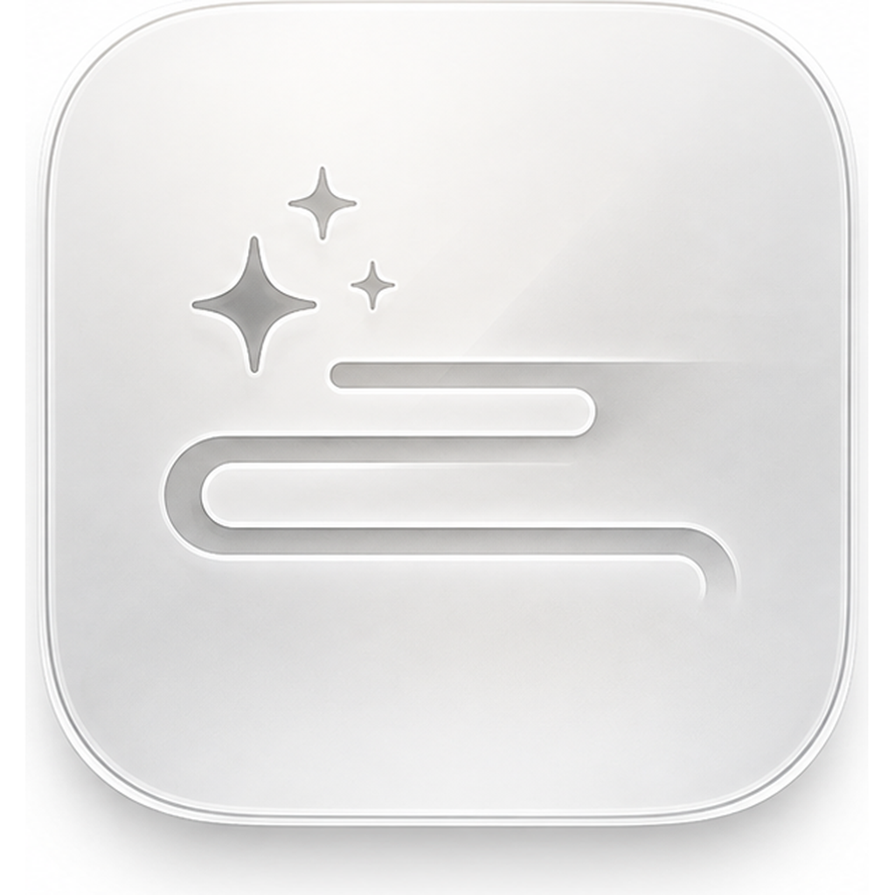
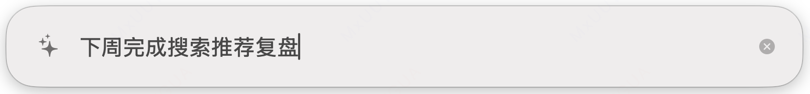
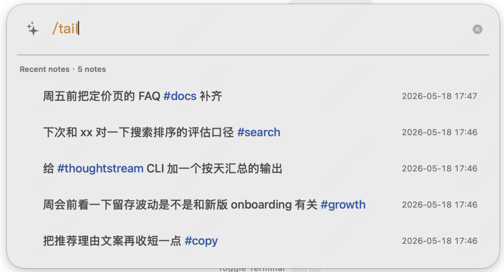
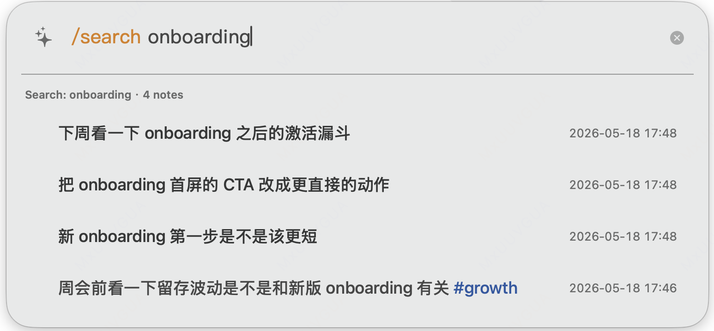

<p align="center">
  <strong>🇨🇳 简体中文</strong>
  &nbsp;&bull;&nbsp;
  <a href="./README.md">🇬🇧 English</a>
</p>

# ThoughtStream

<p align="center">
  
</p>

ThoughtStream 是一个想法收件箱，当前版本主要面向 macOS。

它服务的是这样一条工作流：

- 工作时尽量不被打断
- 想法冒出来，或者有临时需求插进来时，立刻记一下
- 用尽可能低的摩擦记下来，然后继续回到工作
- 之后再统一回顾，在回顾阶段结合 CLI 和 AI 做总结

很多笔记工具的问题，不是不能存，而是太早要求你整理。

ThoughtStream 想做的是另一件事：

1. 先记下，不切上下文
2. 继续工作
3. 之后再回来查、筛、回顾
4. 最后再交给现代 AI 工具做总结

## 适合谁

ThoughtStream 更适合：

- Mac 重度用户
- 开发者和 CLI 用户
- 写作者、研究者、笔记密集型工作者
- 想要比完整 PKM 更轻一点工具的人

它并不打算成为一个全功能笔记工作台。

## 包含什么

- **`ThoughtStreamApp`**
  - 一个 Spotlight 风格的 macOS 覆盖层
  - 全局快捷键：`Shift + Command + Space`
  - 低摩擦捕获、轻量检索和快速回顾
- **`thought`**
  - 用于查询、导出、更新和删除想法的 CLI
  - 面向脚本、自动化、agent 工作流和 AI 辅助回顾
- **`thoughtstream-cli` skill**
  - 一个通过 CLI 操作 ThoughtStream 笔记的仓库内 skill
  - 可以作为 agent 辅助回顾与检索的参考工作流

## 预览

快速记下：



之后用 `/tail` 回来看：



按主题检索：



## 快速开始

### 一行命令安装（需 macOS 13+）

```bash
curl -fsSL https://raw.githubusercontent.com/MoozieLee/thought-stream/main/scripts/install.sh | sh
```

该命令从 GitHub Releases 下载最新 DMG，将应用安装到 `/Applications`，同时创建 `thought` CLI 软链接。

如果某个构建是未签名或 ad hoc 签名，macOS 可能会在首次启动时要求一次手动授权。具体步骤和发布说明见 [分发文档](docs/distribution.zh-Hans.md)。

### 从源码构建

```bash
env HOME=$PWD/.home CLANG_MODULE_CACHE_PATH=$PWD/.build/ModuleCache swift build --product ThoughtStreamApp
env HOME=$PWD/.home CLANG_MODULE_CACHE_PATH=$PWD/.build/ModuleCache swift build --product thought
```

安装并启动应用：

```bash
./scripts/install_app.sh
```

或者直接运行调试版本：

```bash
./.build/debug/ThoughtStreamApp
```

## 基本使用

使用 `Shift + Command + Space` 唤起覆盖层。

- `Enter` 保存当前想法
- `Shift + Enter` 插入换行
- `Esc` 取消输入或退出当前模式
- `↓` 打开最近笔记
- `Tab` 在输入框和结果浏览之间切换

内置斜杠命令包括：

- `/tail`
- `/search <查询>`
- `/today`
- `/tag <标签>`
- `/archive`
- `/hide`
- `/keys`
- `/help`
- `/exit`

结果列表打开后，可以浏览、复用、复制、置顶、归档、删除和编辑已有想法。

## 为什么做这个

ThoughtStream 不是想取代完整笔记软件。

它更关心的是：你在专注工作时，如何用最小代价把一个突然冒出来的想法放进收件箱，然后在之后再用 CLI、过滤和 AI 进行回顾。

所以这个项目刻意偏向：

- 先追加、后整理
- 尽量少打断当前工作
- 覆盖层内只做轻量检索
- 为后续回顾和 AI 总结保留明确的 CLI 入口

同时刻意避免：

- 在捕获当下做重度组织
- 把覆盖层做成完整工作台
- 在捕获阶段强行引入 AI

## 文档

- [快速入门](docs/getting-started.zh-Hans.md)
- [覆盖层指南](docs/overlay.zh-Hans.md)
- [CLI 指南](docs/cli.zh-Hans.md)
- [ThoughtStream CLI Skill](SKILL.md)
- [标签系统](docs/tags.zh-Hans.md)
- [存储架构](docs/storage.zh-Hans.md)
- [发布与分发](docs/distribution.zh-Hans.md)
- [故障排查](docs/troubleshooting.zh-Hans.md)
- [路线图](ROADMAP.md)

## 当前状态

当前版本已支持：

- 原生 macOS 覆盖层捕获
- 以查询为中心的 CLI
- 覆盖层中的斜杠命令
- 结果浏览、复用、复制、置顶、归档、删除和编辑
- `.app`、`.zip`、`.dmg` 的发布打包脚本

## 许可证

[MIT](LICENSE)
